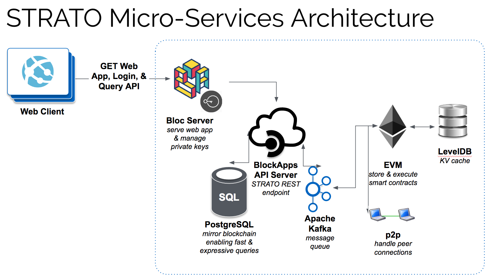
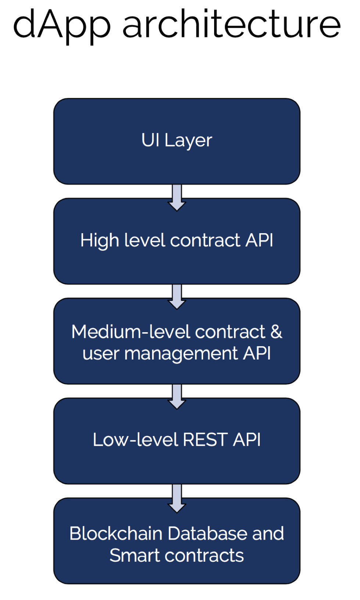

# Introduction

---
## Agenda 

+ BlockApps Intro 
+ Blockchain Concepts and Computing Model
+ BlockApps STRATO Platform - Architecture & Components 
+ Team, Tech, Tools, Processes
+ Challenges
+ Mindset and Culture
+ Engineering
+ Learning as we go
---
## BlockApps - Who we are

+ Market leading Enterprise Blockchain Application Platform Provider
+ Developer of Core Haskell Implementation of Ethereum, with additional developer friendly API's, SDK's and Analytics tools 
+ 1000+ Developers using our Dev Edition (community), 300+ on Azure, many of whom are in production.
+ Developed custom solutions for many large companies.
+ Excited to be a part of the Ethereum Community!

---
### Development Resources 

+ Visit http://developers.blockapps.net
+ Local `getting-started` (https://github.com/blockapps/strato-getting-started)

---
# Blockchain Concepts
---
## Blockchains establish a multi-tenant single source of truth

+ Trying to solve the problem of trust by distributing information.
+ Makes it hard to cheat or forge information.
+ Ordered sequence of facts stored in a shared, fully replicated, distributed database.
---
## P2P communication & consensus

+ A block is an ordered collection of facts (transactions, contracts etc).
+ The full database is replicated on every node.
+ All nodes compete to add a block to the chain using a consensus algorithm (PoW)
+ Each block references the previous block by the hash of its contents, hence the name "blockchain".
---
## Business logic and transaction processing

+ The Ethereum block chain can execute arbitrary programs aka smart contracts.
+ These programs are written in a high level language (Solidity) and then compiled to a low-level, stack based byte code language.
+ Think of the blockchain as a state machine.
+ Transactions are signed data packets from one account to another that link one state to the next.
---
## Immutability and Transparent Auditability

+ Once information is created, it cannot be removed.
+ Verifiable and repeatable audit trail.
+ Deterministic. State transitions can be verified independently by any node.
---
## Identity management

+ Accounts are objects that hold state (ether balance or internal storage).
+ Accounts identified by public private key pairs, and addresses are derived from public keys.
+ They can be of type `contract` (containing code) or externally owned.

---
## Blockchain Components

+ Peer to peer infrastructure - allows Blockchain nodes to discover each other and share data.
+ Consensus algorithm - allows Blockchain nodes to synchronize state.
+ Virtual Machine - processes transactions and updates blockchain state.

---
### Recap
+ What do blockchains provide, and from what point of view?
+ Distributed Systems: P2P communication, consensus, immutability, auditability, transparency
+ Databases: Business logic, transaction processing and EVM
+ Users: Accounts and identity management

---
### Recap
+ What value added products does the BlockApps platform add?
+ Strato Api: Blockchain database - transaction and state storage management
+ Bloc Api: Identity and contract management

---
#  Strato Platform Architecture
---
### Architectural Goals

+ Scale, Throughput, and Concurrency
+ Support Private, Consortium and Public Blockchain Configurations
+ Ease of Integration
+ Ease of Management
---
### Platform Components

---
### dApp: UI, Smart Contracts and Blockchain layer
---

---

### References and Useful Links

+ Visit http://developers.blockapps.net
+ Ethereum White Paper https://github.com/ethereum/wiki/wiki/White-Paper
+ Ethereum Yellow Paper http://yellowpaper.io/
+ Solidity Docs https://solidity.readthedocs.io/en/v0.4.8/

---

# THANK YOU
