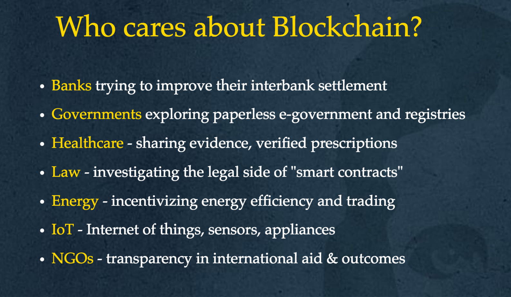
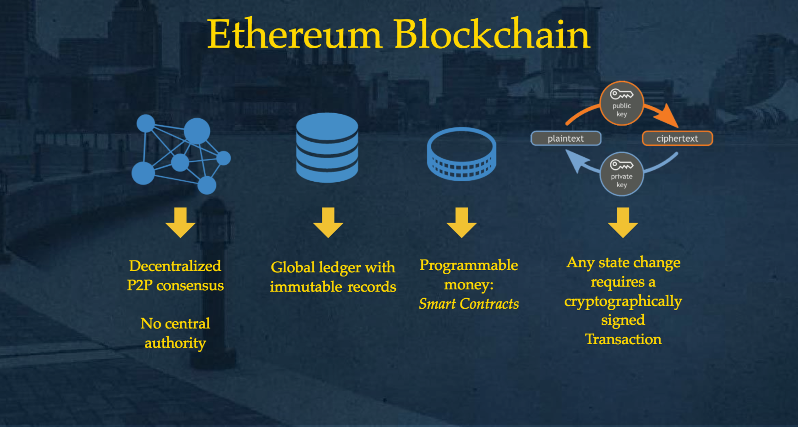
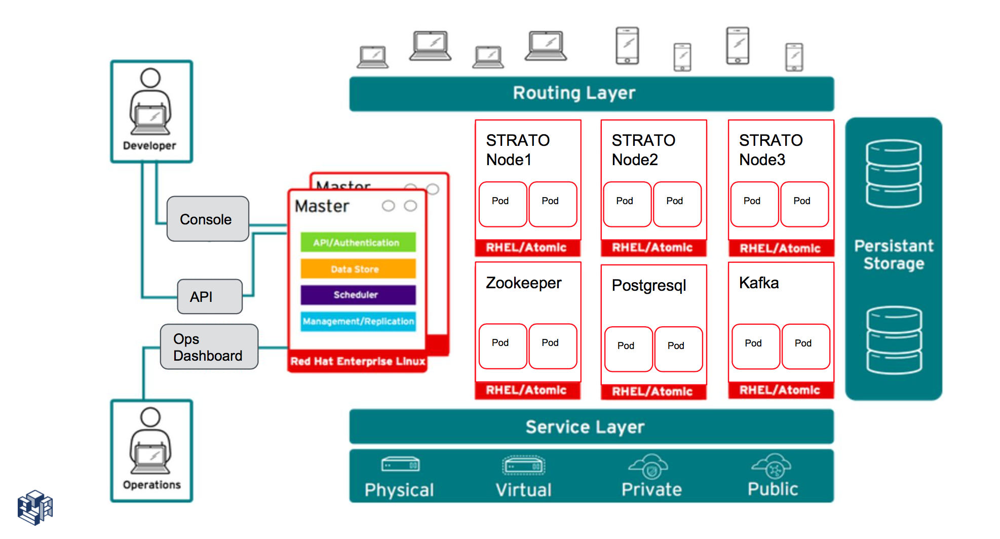
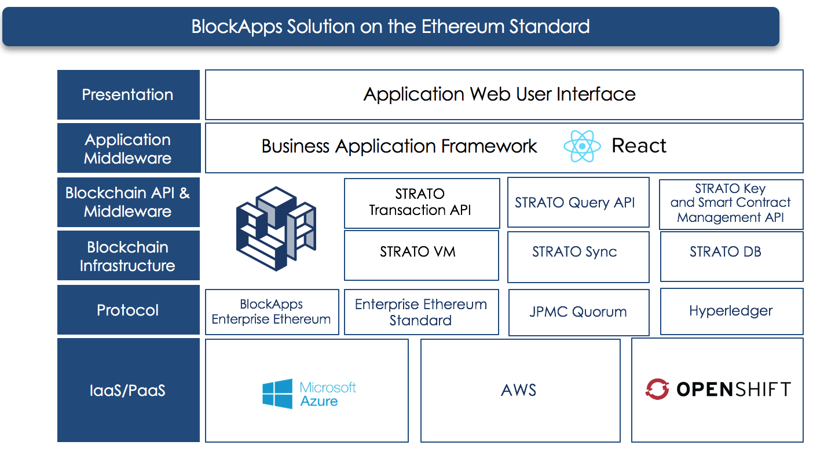

# Introduction

---
## Agenda

+ BlockApps Intro
+ Blockchain Concepts
+ BlockApps STRATO Platform - Architecture & Components
+ Team, Tech, Tools, Processes
+ Challenges: Mindset and Culture
+ Learning as we go
---
## BlockApps - Who we are

+ Market leading Enterprise Blockchain Application Platform Provider
+ Developer of Core Haskell Implementation of Ethereum, with additional developer friendly API's, SDK's and Analytics tools
+ 1000+ Developers using our Dev Edition (community), 300+ on Azure, many of whom are in production.
+ Developed custom solutions for many large companies.
+ Excited to be a part of the Ethereum Community!

---
### Development Resources

+ Visit http://developers.blockapps.net
+ Local `getting-started` (https://github.com/blockapps/strato-getting-started)

---
# Blockchain Concepts
---
## Blockchains establish a decentralized, single source of truth

+ Trying to solve the problem of trust by distributing information.
+ Makes it hard to cheat or forge information.
+ Ordered sequence of facts stored in a shared, fully replicated, distributed database.
---
## P2P communication & consensus

+ A block is an ordered collection of facts (transactions, contracts etc).
+ The full database is replicated on every node.
+ All nodes compete to add a block to the chain using a consensus algorithm (PoW)
+ Each block references the previous block by the hash of its contents, hence the name "blockchain".
---
## Business logic and transaction processing

+ The Ethereum blockchain can execute arbitrary programs aka smart contracts.
+ These programs are written in a high level language (Solidity) and then compiled to a low-level, stack based byte code language.
+ Think of the blockchain as a state machine.
+ Transactions are signed data packets from one account to another that link one state to the next.
---
## Immutability and Transparent Auditability

+ Once information is created, it cannot be removed.
+ Verifiable and repeatable audit trail.
+ Deterministic. State transitions can be verified independently by any node.
---
## Identity management

+ Accounts are objects that hold state (ether balance or internal storage).
+ Accounts identified by public private key pairs, and addresses are derived from public keys.
+ They can be of type `contract` (containing code) or externally owned.

---
## Blockchain Components

+ Peer to peer infrastructure - allows Blockchain nodes to discover each other and share data.
+ Consensus algorithm - allows Blockchain nodes to synchronize state.
+ Virtual Machine - processes transactions and updates blockchain state.

---
### Recap

+ Distributed Systems: P2P communication, consensus, immutability, auditability, transparency
+ Databases: Business logic, transaction processing and EVM
+ Users (humans, IIOT): Accounts and identity management

---

---

---

#  Strato Platform Architecture
---
### Architectural Goals

+ Scale, Throughput, and Concurrency
+ Support Private, Consortium and Public Blockchain Configurations
+ Ease of Integration
+ Ease of Management
---
### Platform Components

---
### dApp: UI, Smart Contracts and Blockchain layer
---

---
# STRATO on OpenShift (Kubernetes)

---

# Tech Stack
+ Haskell (GHC), Go, Node.js, Kafka/ZK, PGSQL, Crypto Libs.
+ Cloud: Azure and AWS. SaaS for Engineering & Product Management Tools

---

# Tech Stack
+ In-house build and packaging tool: basil (Go) that's optimized for our flow and tooling atm.
+ Jenkins pipeline-as-code for CI/CD, BlueOcean FTW!

---
# Journey So far...

+ 2 Engineers hacked something to improve their efficiency developing on Ethereum - a better way to use, program and debug Ethereum!
+ Implemented STRATO core (Ethereum Implementation in Haskell)
+ Created a REST API based development framework to write and manage Smart Contracts, Users/Accounts and Transactions
+ 5 engineers for a year before hiring further.
+ Culture was assumed. Everybody codes, can work together! And we'll all be happy...
---
# Journey So far...
+ Hiring Engineers Vs. Hiring Product focused Engineers
+ Blockchain and Crypto (math) folks
+ Focus was projects, not product.
+ Emerging tech - hard to find what the broader market would need or should evolve to.
+ Product/Market fit, Roadmap evolved with building custom apps and integrations with platform as projects/POC.
---

## Product and Growth focus (1 Quarter and going strong)
+ Prioritized and organized ourselves as Product and Engineering tribes
+ Product: Developer Adoption, Market Research, Product Experience and Enablement.
+ Engineering: R&D, Create IP, Tackle Technology challenges, Build & Release stuff.
---
## Focus on Culture and Data-driven, fast decision making
+ Hire for culture fit - let go of Rockstar A**holes, learn and share, teamwork (win or lose together)
+ Team Achievements, Empathy and Learning-from-failures sticks longer than failures!
+ Build efficiently, Fail-fast and Learn, Measure (Go slow to go fast).
---
## Tried but didn't work for us...
+ Full stack
+ Rockstars
+ Folks sticking to past "Experience" and not "Learning" from present!
+ "Change agents" that preach but can't get their hands dirty
+ Strong Opinions, strongly held!
---
## Myths we've tripped over
+ The Myth of doing it all
+ Failure is not an option
+ You can handle all the fires
+ Scale everything
---

## DevOps Learnings
+ DevOps is Hard! Its all about the Mindset.
+ No matter your previous experience, you'll have to do it the hard way!
+ Handling Complexity (humans and systems) and Security isn't easy.
+ Convenience/Security - Pick one!
---
## DevOps Learnings
+ Web properties: Developer Testnet, Trials, Support E-commerce Checkout, Forums, Developer Site, Customer infra (VPN)
+ Sql injection, DDOS,
+ Key Management, VPN/VPC and Security Groups
+ Convenience vs Security:
+ Big challenge (Data, Identity) in the Blockchain world is changing a long held perception (proven myth) that "locked behind closed doors is secure".
+ Private keys vs user/passwd

### References and Useful Links

+ Visit http://developers.blockapps.net
+ Ethereum White Paper https://github.com/ethereum/wiki/wiki/White-Paper
+ Ethereum Yellow Paper http://yellowpaper.io/
+ Solidity Docs https://solidity.readthedocs.io/en/v0.4.8/

---

# THANK YOU

+ Image Courtesy: The Web, http://slides.com/digitaldonkey, BlockApps
